# DIAGRAM
### 1. Use Case Diagram Sistem Penjualan Tiket Desktop

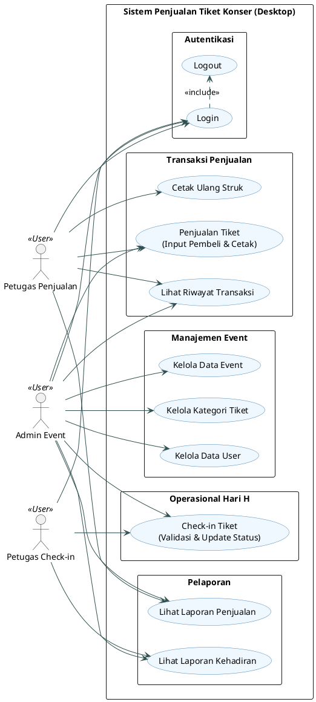

---

### 2. Activity Diagram Proses Penjualan Tiket

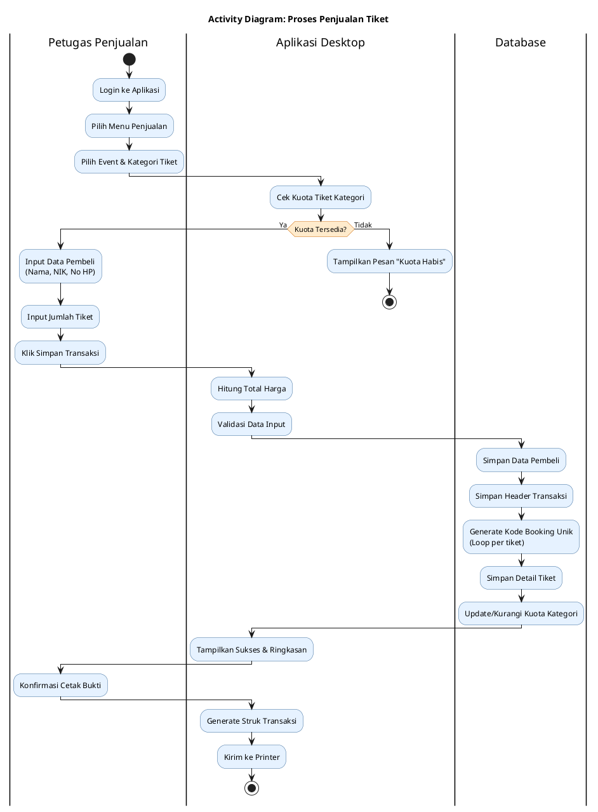

---

### 3. Activity Diagram Proses Check-in Tiket

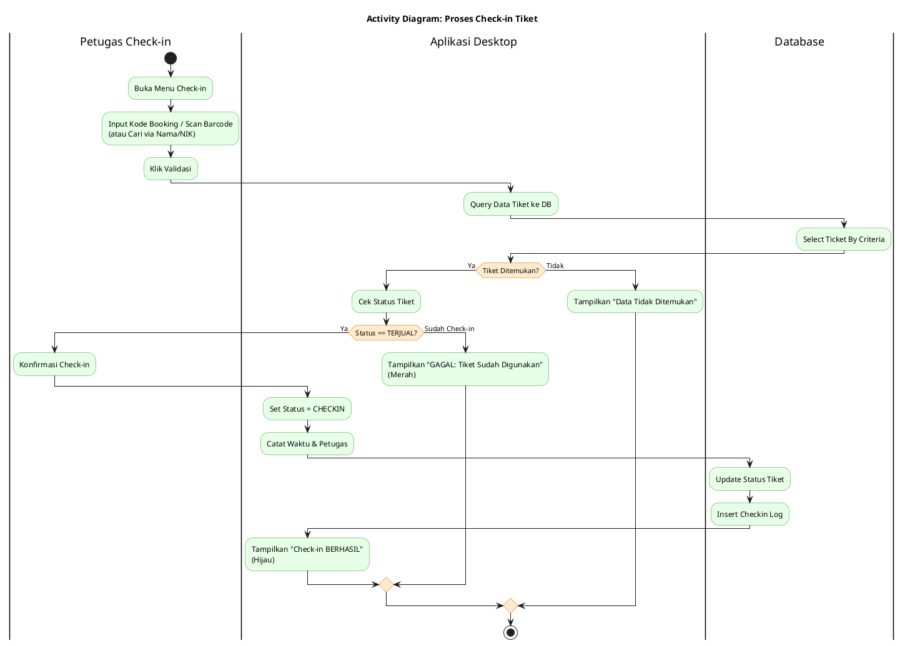

---

### 4. Activity Diagram Proses Kelola Event & Kategori

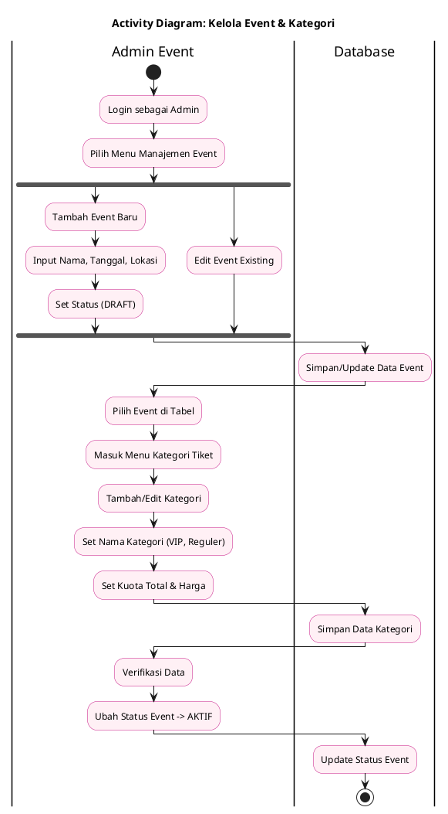

---

### 5. Sequence Diagram Proses Penjualan Tiket

Diagram teknis yang menunjukkan interaksi antar objek (UI, Service, DAO).

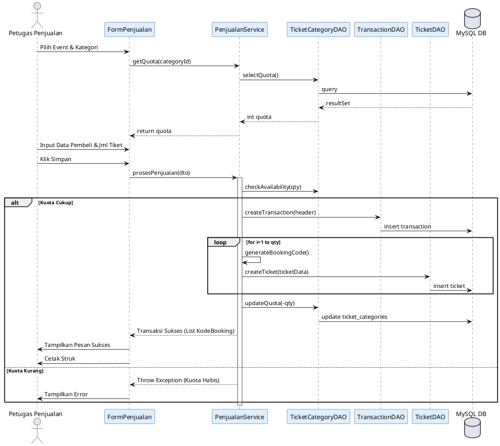

---

### 6. Sequence Diagram Proses Check-in Tiket

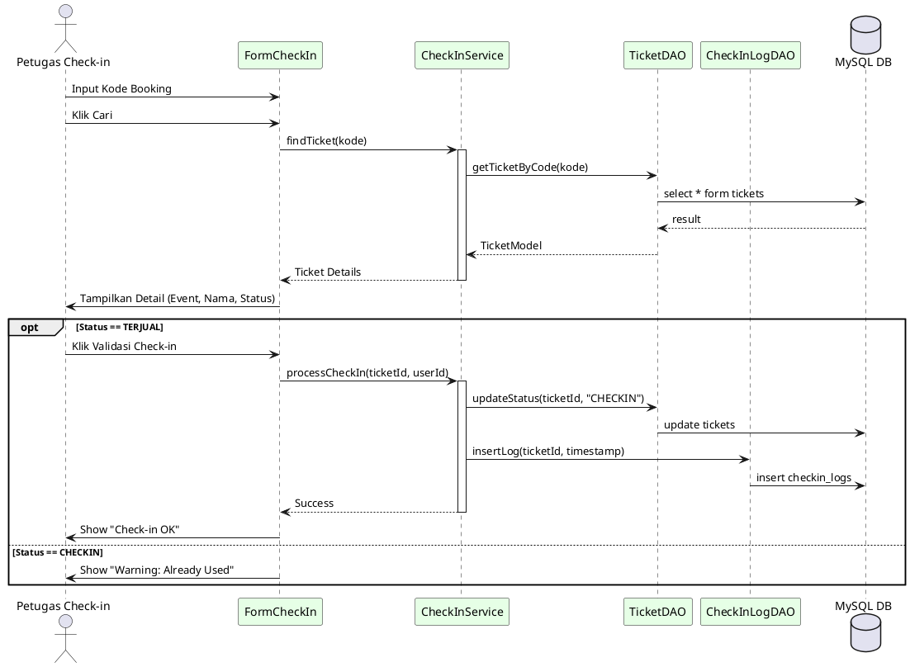

---

### 7. ERD (Entity Relationship Diagram) Lengkap

ERD ini menunjukkan struktur database MySQL dan kardinalitasnya.

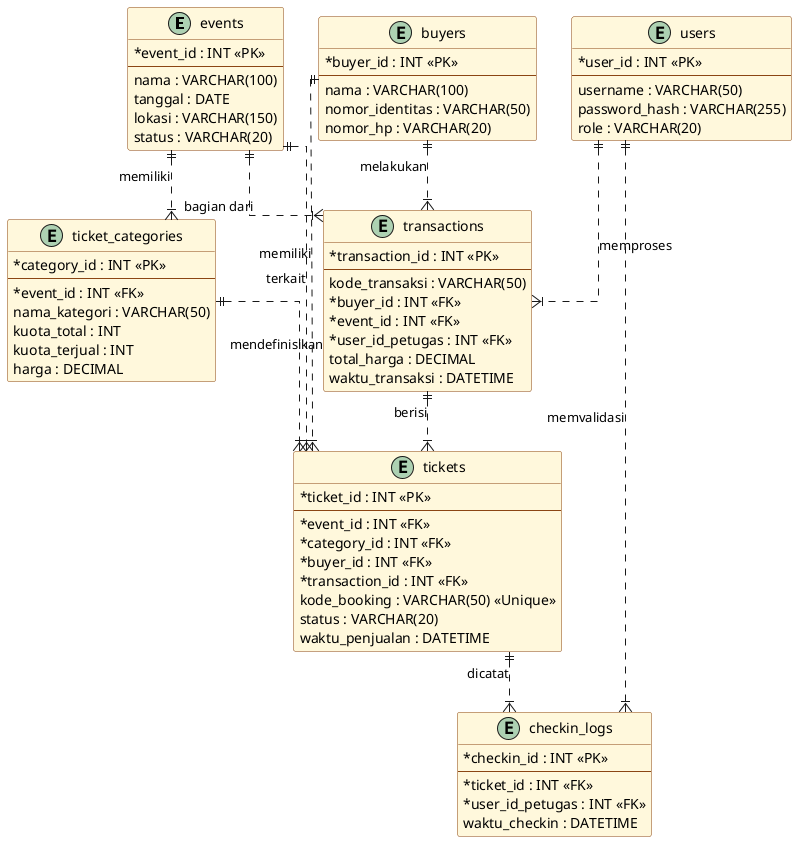

---

### 8. Diagram Navigasi / Hierarki Menu

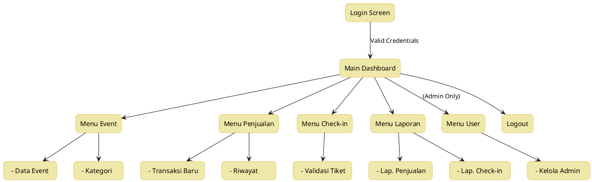

---

### 9. Wireframes (Antarmuka Aplikasi)

#### 9.1 Wireframe Login

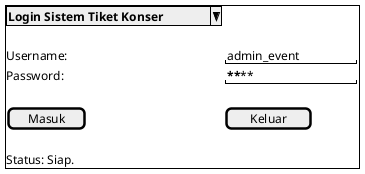

#### 9.2 Wireframe Dashboard Utama

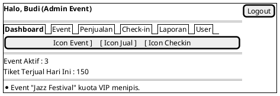

#### 9.3 Wireframe Manajemen Event

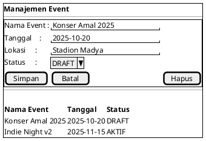

#### 9.4 Wireframe Manajemen Kategori Tiket

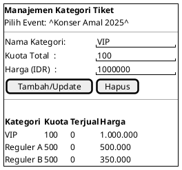

#### 9.5 Wireframe Manajemen User

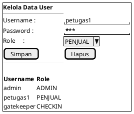

#### 9.6 Wireframe Penjualan Tiket

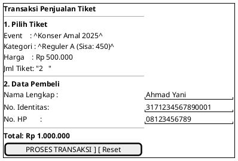

#### 9.7 Wireframe Riwayat Transaksi

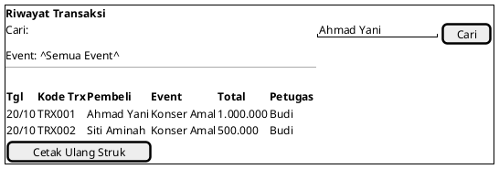

#### 9.8 Wireframe Check-in Tiket

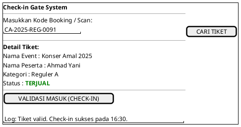

#### 9.9 Layout Laporan Penjualan

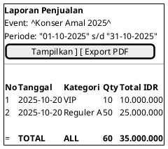

#### 9.10 Layout Laporan Check-in

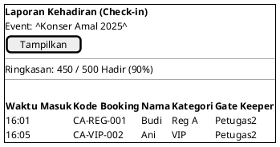

#### 9.11 Layout Struk / Bukti Transaksi

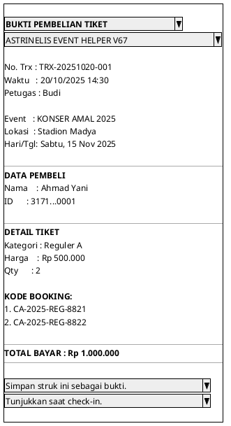
